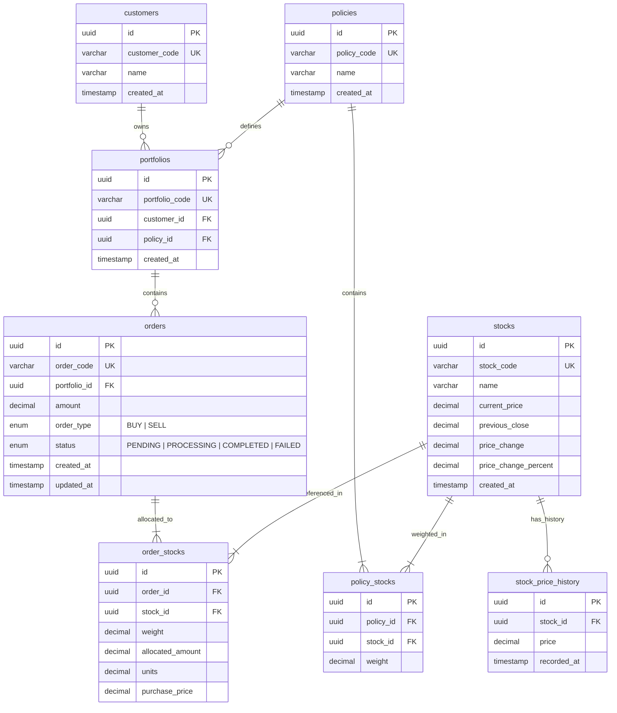
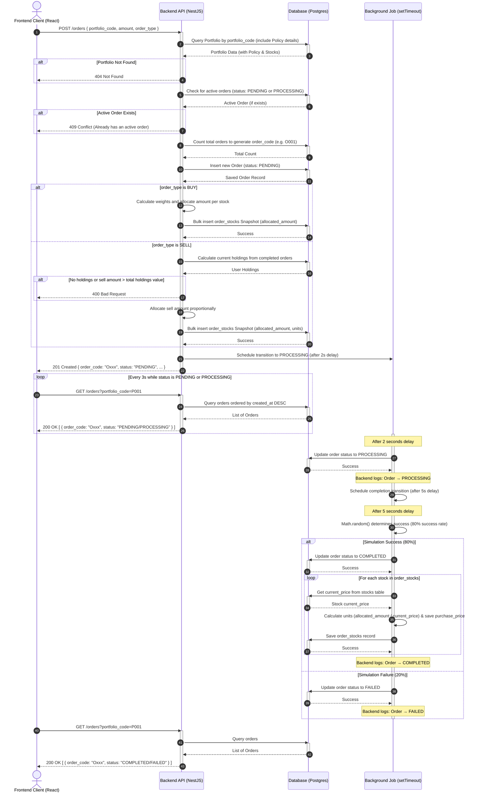

# 📊 แผนภาพระบบจัดการกองทุน (Fund Management System Diagrams)

โฟลเดอร์นี้รวบรวมแผนภาพแสดงการออกแบบโครงสร้างฐานข้อมูล (ER Diagram) และขั้นตอนกระบวนการทำงานของระบบคำสั่งซื้อขายกองทุน (Sequence Diagram) โดยใช้รูปแบบของ **Mermaid**

---

## 🗄️ 1. แผนภาพความสัมพันธ์ฐานข้อมูล (Entity-Relationship Diagram)

แผนภาพนี้แสดงโครงสร้างของฐานข้อมูล PostgreSQL ทั้งหมด 8 ตาราง พร้อมความสัมพันธ์ (One-to-Many, Many-to-One) และคุณสมบัติของคอลัมน์ต่าง ๆ:



### รายละเอียดตารางและความสัมพันธ์:
- **`customers` (ลูกค้า):** ลูกค้า 1 คนสามารถมีพอร์ตการลงทุน (`portfolios`) ได้หลายพอร์ต
- **`policies` (นโยบายการลงทุน):** นโยบาย 1 นโยบายจะกำหนดสัดส่วนหุ้นประกอบนโยบายลงใน `policy_stocks`
- **`policy_stocks` (สัดส่วนน้ำหนักหุ้น):** ตารางเชื่อมโยงระบุว่าแต่ละนโยบายถือหุ้นตัวไหนและน้ำหนักสัดส่วน (%) เท่าไร
- **`portfolios` (พอร์ตลงทุน):** เชื่อมโยงลูกค้าและนโยบายเข้าด้วยกัน (1 พอร์ตลงทุนจะผูกติดได้เพียง 1 นโยบาย)
- **`orders` (คำสั่งซื้อขาย):** คำสั่งซื้อขายที่ลูกค้าส่งเข้ามาในพอร์ต โดยเก็บประวัติสถานะและมูลค่าเงินลงทุนทั้งหมด
- **`order_stocks` (สแนปช็อตการกระจายเงิน):** บันทึกประวัติสัดส่วนน้ำหนักและจำนวนเงินจริง ณ เวลาที่ทำรายการซื้อขาย เพื่อเป็นฐานข้อมูลตรวจสอบย้อนหลังที่ถูกต้อง (Audit Trail)
- **`stock_price_history` (ประวัติราคาหุ้น):** บันทึกประวัติราคาย้อนหลังเพื่อใช้อ้างอิงการปรับตัวของตลาด

---

## 🔄 2. แผนภาพขั้นตอนการทำธุรกรรม (Order Creation & Lifecycle Sequence Diagram)

แผนภาพนี้จำลองกระบวนการทำงานตั้งแต่ Frontend (React Client) ยิงคำขอสร้างออเดอร์ใหม่ ไปจนถึงการทำสแนปช็อตสัดส่วนเงินลงทุน การสลับสถานะอัตโนมัติในฝั่งหลังบ้าน (Simulation Delay) และการส่งข้อมูลอัปเดตกลับไปแสดงผลแบบเรียลไทม์ผ่านการทำ Polling:



---

## 📌 วิธีดูแผนภาพเหล่านี้
1. **GitHub / VS Code Markdown Preview:** หากแสดงผลบน GitHub หรือโปรแกรมเขียนโค้ดที่รองรับ Markdown + Mermaid แผนภาพทั้งสองด้านบนจะแสดงเป็นกราฟิกสวยงามโดยอัตโนมัติ
2. **Mermaid Live Editor:** คุณสามารถคัดลอกโค้ดภายในบล็อก ` ```mermaid ... ``` ` ไปวางที่ [Mermaid Live Editor](https://mermaid.live/) เพื่อแก้ไขสีสัน ตกแต่ง เพิ่มเติม หรือส่งออกเป็นรูปภาพ (PNG, SVG, PDF) ได้ทันที
